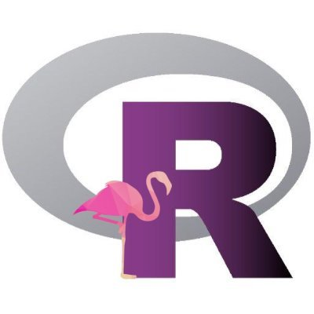
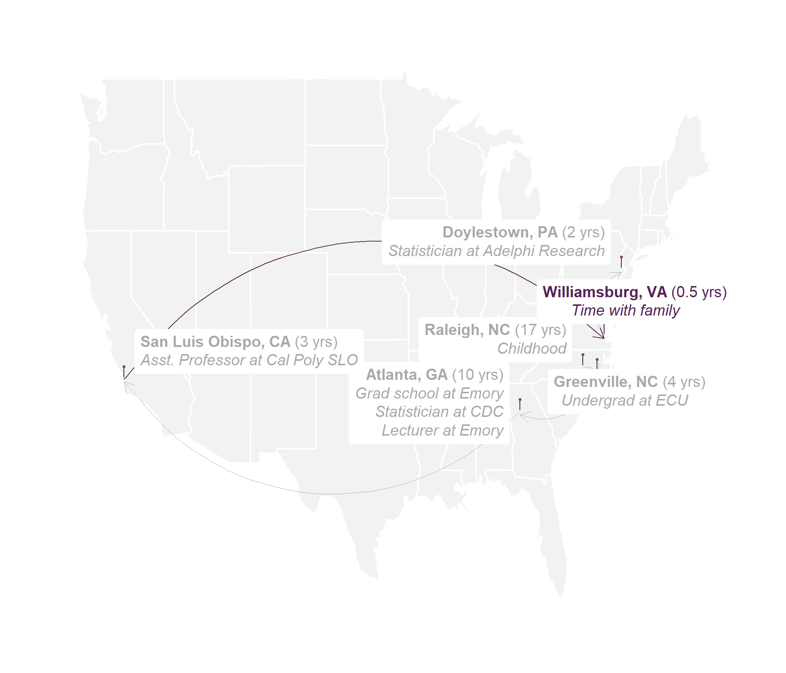
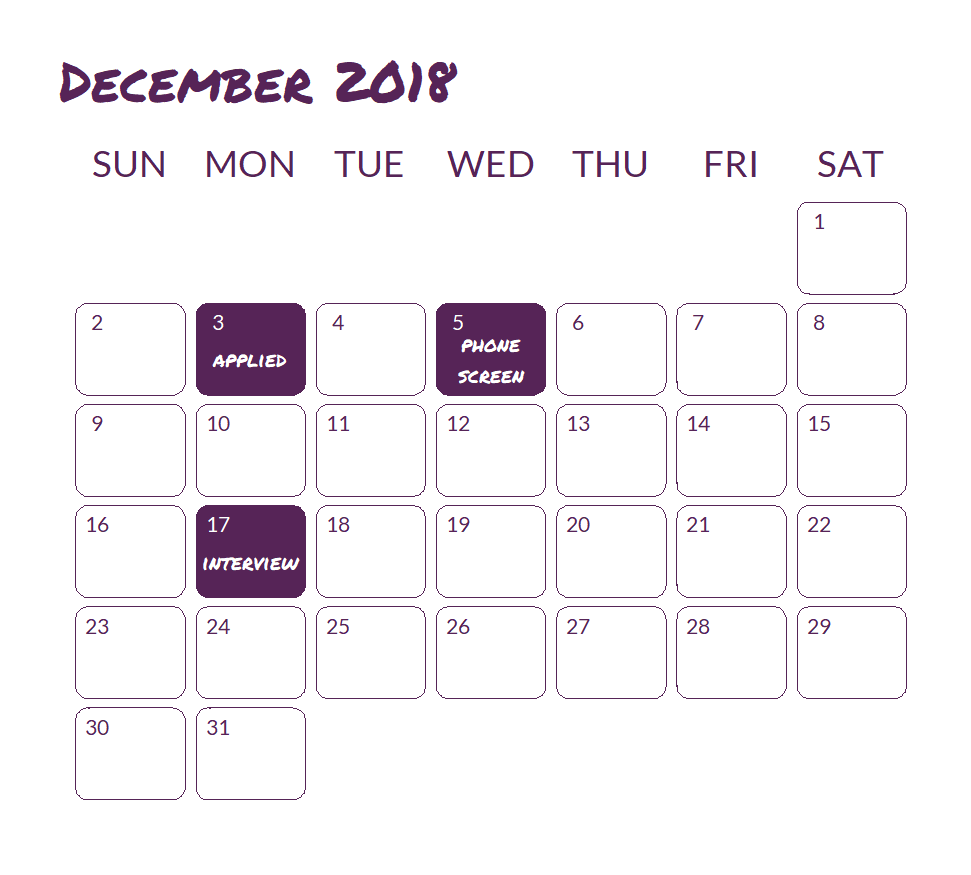

```{r setup, include=FALSE}
options(htmltools.dir.version = FALSE)
```

class: split-two white with-border

.column.bg-main1[.content.center[


# R-Ladies Global  

### [`r fontawesome::fa("twitter", fill = "#FFFFFF")` @RLadiesGlobal](https://twitter.com/rladiesglobal)<br/>

### [`r fontawesome::fa("paper-plane", fill = "#FFFFFF")` info@rladies.org](mailto:info@rladies.org)<br>

### [`r fontawesome::fa("link", fill = "#FFFFFF")` rladies.org](https://rladies.org)<br/>

### [`r fontawesome::fa("slack", fill = "#FFFFFF")` Join R-Ladies Slack](https://rladies-community-slack.herokuapp.com/)

]]

.column.bg-main2[.content.center[



# R-Ladies Miami  

### [`r fontawesome::fa("twitter", fill = "#FFFFFF")` @RLadiesMiami](https://twitter.com/RLadiesMiami)<br/>

### [`r fontawesome::fa("paper-plane", fill = "#FFFFFF")` miami@rladies.org](mailto:miami@rladies.org)<br>

]]

---

class: split-two white with-border

.column.bg-main2[.content.center[


# Dr. Shannon Pileggi <br><br>

### [`r anicon::faa("twitter", animate="float", color = "#FFFFFF")` @PipingHotData](https://twitter.com/PipingHotData)<br/>

### [`r fontawesome::fa("paper-plane", fill = "#FFFFFF")` shannon@pipinghotdata.com](mailto:shannon@pipinghotdata.com)<br>

### [`r fontawesome::fa("link", fill = "#FFFFFF")` pipinghotdata.com](https://www.pipinghotdata.com/)<br/>

### [`r fontawesome::fa("github", fill = "#FFFFFF")` https://github.com/shannonpileggi](https://github.com/shannonpileggi/)

### [`r fontawesome::fa("linkedin", fill = "#FFFFFF")` linkedin.com/in/shannon-m-pileggi/](https://www.linkedin.com/in/shannon-m-pileggi/)

]]

.column.bg-main1[.content.vmiddle.center[

### Presentation based on<br> the Aug 30, 2020 blog post:<br><br>

### [`r anicon::faa("link", animate="vertical", color = "#FFFFFF")` A job interview presentation<br> inspired by the R community: <br>How TidyTuesday and Twitter<br> helped me secure a job offer](https://www.pipinghotdata.com/posts/2020-08-30-a-job-interview-presentation-inspired-by-the-r-community/)<br/>

]]

---

layout: true
class: split-two with-thick-border border-white

.column[.content[
.split-two[
.row.bg-main5[.content.center.vmiddle[
# 1 <br><br> BACKGROUND
]]
.row.bg-main2[.content.center.vmiddle[
# 3 <br><br> CREATOR
]]
]
]]

.column[.content[
.split-two[
.row.bg-main3[.content.center.vmiddle[
# 2 <br><br> CONSUMER
]]
.row.bg-main1[.content.center.vmiddle[
# 4 <br><br> COLLABORATOR
]]
]
]]

??? INTRODUCE BACKGROUND

---

---
count: false
class: gray-row2-col1 gray-row1-col2 gray-row2-col2

---
layout: false
class: bg-main5 split-20 

.column.bg-main4[.content.vmiddle.center[

# Life changes <br><br>

.row[.content.nopadding[
.fig90[]
]] <br>

### Map adapted from <br><br> [`r anicon::faa("link", animate="vertical", color = "#FFFFFF")`](https://www.pipinghotdata.com/posts/2021-02-15-gganimating-a-geographic-introduction/) GGanimating <br> a geographic introduction

]]

.column.bg-main5[.content.center[

.row[.content.nopadding[
.img-fill[]
]]

]]


---
layout: false
class: bg-main5 split-70 

.column.bg-main5[.content.vmiddle.center[

# Job interview <br><br>

.row[.content.nopadding[
.fig90[]
]]

]]

.column.bg-main4[.content.vmiddle.center[

# Job interview<br>presentation instructions

<br><br>

### 20 minutes 

### focuses on market research

### innovative

### proud of

]]


---

layout: true
class: split-two with-thick-border border-white

.column[.content[
.split-two[
.row.bg-main5[.content.center.vmiddle[
# 1 <br><br> BACKGROUND
]]
.row.bg-main2[.content.center.vmiddle[
# 3 <br><br> CREATOR
]]
]
]]

.column[.content[
.split-two[
.row.bg-main3[.content.center.vmiddle[
# 2 <br><br> CONSUMER
]]
.row.bg-main1[.content.center.vmiddle[
# 4 <br><br> COLLABORATOR
]]
]
]]

??? INTRODUCE CREATOR


---
count: false
class: gray-row1-col1 gray-row2-col1 gray-row2-col2

