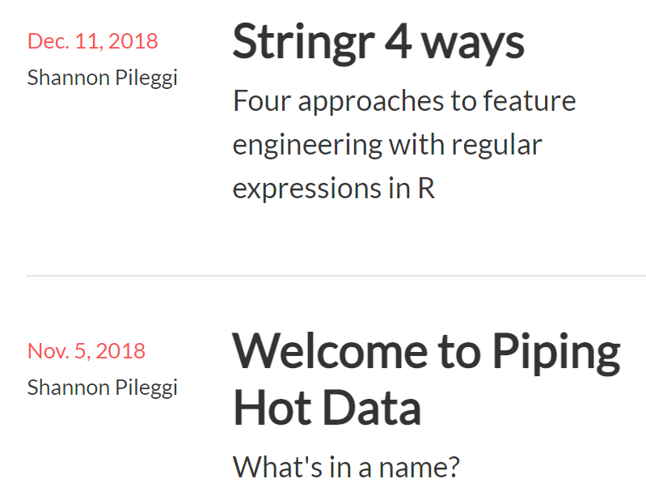
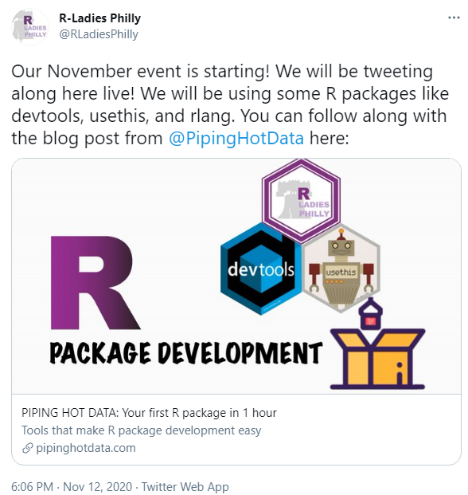
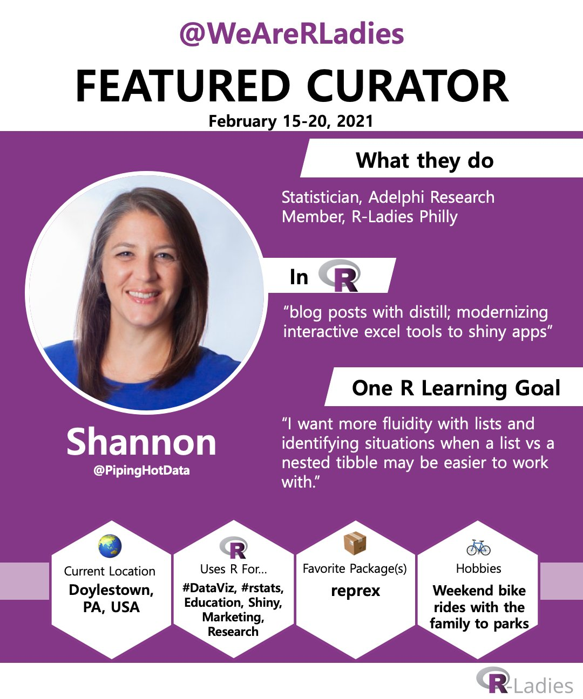
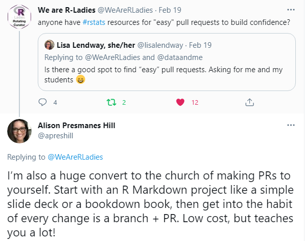

```{r setup, include=FALSE}
options(htmltools.dir.version = FALSE)
```

class: inverse 
count: false

background-image: url(img/vedrana-filipovic-wMQxgk2NhvI-unsplash.jpg)
background-size: cover
.title-slide-shannon[
# Growing into the R Community
# Shannon Pileggi
# April 22, 2021
<br><br><br><br><br><br><br><br><br><br><br><br><br><br><br><br><br>
.right[
### Photo by [Vedrana Filipović](https://unsplash.com/photos/wMQxgk2NhvI)
]
]


---
class: split-two white with-border

.column.bg-main1[.content.center[

<br/><br/>


<br/>
# R-Ladies Global  
<br/>
### [`r fontawesome::fa("twitter", fill = "#FFFFFF")` @RLadiesGlobal](https://twitter.com/rladiesglobal)<br/>

### [`r fontawesome::fa("paper-plane", fill = "#FFFFFF")` info@rladies.org](mailto:info@rladies.org)<br>

### [`r fontawesome::fa("link", fill = "#FFFFFF")` rladies.org](https://rladies.org)<br/>

### [`r fontawesome::fa("slack", fill = "#FFFFFF")` Join R-Ladies Slack](https://rladies-community-slack.herokuapp.com/)

]]

.column.bg-main3[.content.center[

<br/><br/>


<br/>
# R-Ladies Miami  
<br/>
### [`r fontawesome::fa("twitter", fill = "#FFFFFF")` @RLadiesMiami](https://twitter.com/RLadiesMiami)<br/>

### [`r fontawesome::fa("paper-plane", fill = "#FFFFFF")` miami@rladies.org](mailto:miami@rladies.org)<br>

]]

---

class: split-two white with-border

.column.bg-main3[.content.center[
<br/><br/>


# Dr. Shannon Pileggi <br/><br/>

### [`r anicon::faa("twitter", animate="float", color = "#FFFFFF")` @PipingHotData](https://twitter.com/PipingHotData)<br/>

### [`r fontawesome::fa("paper-plane", fill = "#FFFFFF")` shannon@pipinghotdata.com](mailto:shannon@pipinghotdata.com)<br>

### [`r fontawesome::fa("link", fill = "#FFFFFF")` pipinghotdata.com](https://www.pipinghotdata.com/)<br/>

### [`r fontawesome::fa("github", fill = "#FFFFFF")` github.com/shannonpileggi](https://github.com/shannonpileggi/)

### [`r fontawesome::fa("linkedin", fill = "#FFFFFF")` linkedin.com/in/shannon-m-pileggi/](https://www.linkedin.com/in/shannon-m-pileggi/)

]]

.column.bg-main1[.content.vmiddle.center[

### Presentation based on<br> the Aug 30, 2020 blog post:<br><br>

### [`r anicon::faa("link", animate="vertical", color = "#FFFFFF")` A job interview presentation<br> inspired by the R community: <br>How TidyTuesday and Twitter<br> helped me secure a job offer](https://www.pipinghotdata.com/posts/2020-08-30-a-job-interview-presentation-inspired-by-the-r-community/)<br/>

]]

---

layout: true
class: split-two with-thick-border border-white

.column[.content[
.split-two[
.row.bg-main4[.content.center.vmiddle[
# 1 <br><br> BACKGROUND
]]
.row.bg-main2[.content.center.vmiddle[
# 3 <br><br> CREATOR
]]
]
]]

.column[.content[
.split-two[
.row.bg-main3[.content.center.vmiddle[
# 2 <br><br> CONSUMER
]]
.row.bg-main1[.content.center.vmiddle[
# 4 <br><br> CONTRIBUTOR
]]
]
]]

??? INTRODUCE BACKGROUND

---

---
count: false
class: gray-row2-col1 gray-row1-col2 gray-row2-col2

---
layout: false
class: bg-main5 split-20 

.column.bg-main3[.content.vmiddle.center[

#  LIFE CHANGES <br>

#  July 2018 <br>

.row[.content.nopadding[
.fig90[]
]] <br>

### Map adapted from <br><br> [`r anicon::faa("link", animate="vertical", color = "#FFFFFF")`](https://www.pipinghotdata.com/posts/2021-02-15-gganimating-a-geographic-introduction/) GGanimating <br> a geographic introduction

]]

.column.bg-main5[.content.center[

.row[.content.nopadding[
```{r, echo=FALSE, out.width="90%"}
knitr::include_graphics("img/residences_flat_3.png")
```
]]
]]

---
class: middle left bg-main1 
<br>

## Date: Oct 19, 2018

## To: Friend

## From: Shannon Pileggi

<br>

## _As far as the job search goes, I haven't found the right fit yet.  Now I am focusing more on fully remote companies.  In the meanwhile, I am starting to do some side projects to keep me active and build an online presence.  So hopefully my new blog will launch next week!  And I plan to get on twitter as well - I'm a bit scared of that!  I've been reading up on twitter etiquette so hopefully I don't do anything dumb._


---
layout: false
class: bg-main3 split-70 

.column.bg-main3[.content.vmiddle.center[

.row[.content.nopadding[
.fig90[]
]]

]]

.column.bg-main3[.content.vmiddle.center[

# Job interview<br>presentation instructions

<br><br>

### 20 minutes 

### focuses on market research

### innovative

### proud of

]]


---

layout: true
class: split-two with-thick-border border-white

.column[.content[
.split-two[
.row.bg-main4[.content.center.vmiddle[
# 1 <br><br> BACKGROUND
]]
.row.bg-main2[.content.center.vmiddle[
# 3 <br><br> CREATOR
]]
]
]]

.column[.content[
.split-two[
.row.bg-main3[.content.center.vmiddle[
# 2 <br><br> CONSUMER
]]
.row.bg-main1[.content.center.vmiddle[
# 4 <br><br> CONTRIBUTOR
]]
]
]]

??? INTRODUCE CONSUMER


---
count: true
class: gray-row1-col1 gray-row2-col1 gray-row2-col2


---
layout: true
class: split-three with-thick-border border-white

.column[.content[
.split-three[
.row.bg-main5[.content.center.vmiddle[
# What is the R community?
]]
.row.bg-main3[.content.center.vmiddle[
# Podcasts
]]
.row.bg-main2[.content.center.vmiddle[
# TidyTuesday
]]
]
]]

.column[.content[
.split-three[
.row.bg-main3[.content.center.vmiddle[
# YouTube
]]
.row.bg-main2[.content.center.vmiddle[
# Slack
]]
.row.bg-main1[.content.center.vmiddle[
# Meet-ups
]]
]
]]

.column[.content[
.split-three[
.row.bg-main2[.content.center.vmiddle[
# Twitter
]]
.row.bg-main1[.content.center.vmiddle[
# Conferences
]]
.row.bg-main3[.content.center.vmiddle[
# Blogs
]]
]
]]

??? what is R community

---
count: true
class: hide-row1-col2 hide-row1-col3 hide-row2-col1 hide-row2-col2 hide-row2-col3 hide-row3-col1 hide-row3-col2 hide-row3-col3

---
count: false


---
layout: false
class: bg-main3 split-70 

.column.bg-main3[.content.vmiddle.center[

.row[.content.nopadding[
.fig90[]
]]

]]

.column.bg-main3[.content.vmiddle.center[
<blockquote class="twitter-tweet"><p lang="en" dir="ltr">In this week&#39;s <a href="https://twitter.com/hashtag/tidytuesday?src=hash&amp;ref_src=twsrc%5Etfw">#tidytuesday</a> screencast, I use tidytext to analyze what titles get claps on Medium posts. Practical guides on tensorflow/keras are the hottest, words like &quot;marketing&quot;, &quot;trends&quot; and &quot;industry&quot; don&#39;t get you far <a href="https://t.co/oNhZm40mpW">https://t.co/oNhZm40mpW</a> <a href="https://twitter.com/hashtag/rstats?src=hash&amp;ref_src=twsrc%5Etfw">#rstats</a> <a href="https://t.co/cxYO2MIIqz">pic.twitter.com/cxYO2MIIqz</a></p>&mdash; David Robinson (@drob) <a href="https://twitter.com/drob/status/1069954125020958720?ref_src=twsrc%5Etfw">December 4, 2018</a></blockquote> <script async src="https://platform.twitter.com/widgets.js" charset="utf-8"></script>
]]

---

background-image: url(img/compare-1.svg)
background-size: cover


---
layout: false
class: bg-main3 split-70 

.column.bg-main3[.content.vmiddle.center[

.row[.content.nopadding[
.fig90[]
]]

]]

.column.bg-main3[.content.vmiddle.center[
<blockquote class="twitter-tweet"><p lang="en" dir="ltr">If you’re having trouble with xaringan, storyboards in flexdashboqrd can also make pretty nice presentations depending on the type of content / message you are trying to convey <a href="https://t.co/IC3moe01v0">https://t.co/IC3moe01v0</a></p>&mdash; Emily Riederer (@EmilyRiederer) <a href="https://twitter.com/EmilyRiederer/status/1073001289339027456?ref_src=twsrc%5Etfw">December 12, 2018</a></blockquote> <script async src="https://platform.twitter.com/widgets.js" charset="utf-8"></script>

]]


---
layout: false
class: bg-main3 split-70 

.column.bg-main3[.content.vmiddle.center[

.row[.content.nopadding[
.fig90[]
]]

]]

.column.bg-main3[.content.vmiddle.center[
<blockquote class="twitter-tweet"><p lang="en" dir="ltr">EMILY! this just blew my mind 🤯 thank you!</p>&mdash; Alison Presmanes Hill (@apreshill) <a href="https://twitter.com/apreshill/status/1073002204158603264?ref_src=twsrc%5Etfw">December 12, 2018</a></blockquote> <script async src="https://platform.twitter.com/widgets.js" charset="utf-8"></script>
]]


---
layout: true
class: split-two with-thick-border border-white

.column[.content[
.split-two[
.row.bg-main5[.content.center.vmiddle[
# 1 <br><br> BACKGROUND
]]
.row.bg-main2[.content.center.vmiddle[
# 3 <br><br> CREATOR
]]
]
]]

.column[.content[
.split-two[
.row.bg-main3[.content.center.vmiddle[
# 2 <br><br> CONSUMER
]]
.row.bg-main1[.content.center.vmiddle[
# 4 <br><br> CONTRIBUTOR
]]
]
]]

---
count: false
class: gray-row1-col1 gray-row1-col2 gray-row2-col2


---
layout: false
background-image: url(img/compare-1.svg)
background-size: cover

---
layout: false
count: false
background-image: url(img/compare-2.svg)
background-size: cover

---
layout: false
count: false
background-image: url(img/compare-3.svg)
background-size: cover

---
layout: false
count: false
background-image: url(img/compare-4.svg)
background-size: cover

--
.title-slide-shannon[
<br><br><br><br>
.right[
### [technical details `r anicon::faa("link", animate="vertical", color = "#FFFFFF")`](https://www.pipinghotdata.com/posts/2020-08-30-a-job-interview-presentation-inspired-by-the-r-community/#what-i-did)

### [@drob code `r fontawesome::fa("github", fill = "#FFFFFF")`](https://github.com/dgrtwo/data-screencasts/blob/master/medium-datasci.Rmd)

### [@drob video `r fontawesome::fa("youtube", fill = "#FFFFFF")`](https://www.youtube.com/watch?v=C69QyycHsgE)

]]

---
layout: false
class: split-two bg-main2

.column[.content[
.split-two[
.row.bg-main2[.center.vmiddle[
### [`r fontawesome::fa("link")` Presentation](https://spileggi.shinyapps.io/Pileggi_presentation_shiny/)<br/>

]]
.row.bg-main2[.center[
### [`r fontawesome::fa("link")` Shiny 1](https://spileggi.shinyapps.io/tweet_lookup/)<br/>

]]
]
]]

.column[.content[
.split-two[
.row.bg-main2[.center.vmiddle[
### [`r fontawesome::fa("link")` Code](https://github.com/shannonpileggi/Adelphi-tweets)<br/>

]]
.row.bg-main2[.center[
### [`r fontawesome::fa("link")` Shiny 2](https://spileggi.shinyapps.io/tweet_network/)<br/>

]]
]
]]

---

class: center middle

```{r, echo=FALSE, out.width="70%"}
knitr::include_graphics("https://media.giphy.com/media/N1eKZPdggHGwM/giphy.gif")
```


---
layout: false
class: split-two white with-border

.column.bg-main2[.content.left.center[
<br><br>
# WHAT I DID WELL
<br><br>
## Mirrored TidyTuesday analysis
<br>
## Researched audience
<br>
## Hosted presentation online 
<br>
## Didn’t use powerpoint

]]

.column.bg-main1[.content.left.center[
<br><br>
# WHAT I WOULD HAVE DONE DIFFERENTLY
<br><br>
## Limited scope
<br>
## Change ggplot default colors

]]

---
background-image: url(img/austin-neill-ZahNAl_Ic3o-unsplash.jpg)
background-size: cover
.title-slide-shannon[
<br><br><br><br><br><br><br><br><br><br><br><br><br><br><br><br><br><br><br><br><br><br><br><br><br><br><br>
.right[
### Photo by [Austin Neil](https://unsplash.com/photos/ZahNAl_Ic3o)
]
]

???
re-using learnings in work & personal
scaffolding to more open-ended projects?


---

layout: true
class: split-two with-thick-border border-white

.column[.content[
.split-two[
.row.bg-main5[.content.center.vmiddle[
# 1 <br><br> BACKGROUND
]]
.row.bg-main2[.content.center.vmiddle[
# 3 <br><br> CREATOR
]]
]
]]

.column[.content[
.split-two[
.row.bg-main3[.content.center.vmiddle[
# 2 <br><br> CONSUMER
]]
.row.bg-main1[.content.center.vmiddle[
# 4 <br><br> CONTRIBUTOR
]]
]
]]

---
count: false
class: gray-row1-col1 gray-row1-col2 gray-row2-col1

??? INTRODUCE contributor


---
layout: true
class: split-two with-thick-border border-black

.column[.content[
.split-two[
.row.bg-main2[.content.left.vmiddle[
# You might be thinking 
# something like...
### Mara Averick, rstudio::conf(2018)
### [Contributing to Tidyverse packages](https://www.rstudio.com/resources/rstudioconf-2018/contributing-to-tidyverse-packages/)
]]
.row.bg-main5[.content[
```{r, echo=FALSE, out.width="50%"}
knitr::include_graphics("img/mara-first-contribution.PNG")
```
]]
]]

.column[.content[
.split-two[
.row.bg-main5[.content[
```{r, echo=FALSE, out.width="100%"}
knitr::include_graphics("img/mara-contributing-tidyverse.PNG")
```
]]
.row.bg-main2[.content.right.vmiddle[
# but contributing can be more<br> than packages, pull requests,<br> and issues!
]]
]
]]

---
count: true
class: hide-row2-col1 hide-row2-col2

---
count: false


---
layout: true
class: split-three with-thick-border border-white

.column[.content[
.split-three[
.row.bg-main5[.content.center.vmiddle[
# How do I contribute?
]]
.row.bg-main3[.content.center.vmiddle[
# Podcasts
]]
.row.bg-main2[.content.center.vmiddle[
# TidyTuesday
]]
]
]]

.column[.content[
.split-three[
.row.bg-main3[.content.center.vmiddle[
# YouTube
]]
.row.bg-main2[.content.center.vmiddle[
# Slack
]]
.row.bg-main1[.content.center.vmiddle[
# Meet-ups
]]
]
]]

.column[.content[
.split-three[
.row.bg-main2[.content.center.vmiddle[
# Twitter
]]
.row.bg-main1[.content.center.vmiddle[
# Conferences
]]
.row.bg-main3[.content.center.vmiddle[
# Blogs
]]
]
]]

??? how am i a contributor

---
count: true

---
count: false
class: gray-row1-col2 gray-row2-col1 gray-row2-col3 gray-row3-col1 


---
layout: true
class: split-two with-thick-border border-gray

.row[.content[
.split-three[
.column.bg-main5[.content.center.vmiddle[
.img-fill[]
]]
.column.bg-main3[.content.center.vmiddle[
.img-fill[]
]]
.column.bg-main2[.content.center.vmiddle[
### moved 
<br>
### new job
<br>
### COVID-19
]]
]
]]

.row[.content[
.split-four[
.column.bg-main5[.content.center.vmiddle[
.img-fill[]
]]
.column.bg-main1[.content.center.vmiddle[
### since Aug 30, 2020 
<br>
### 9 blog posts
]]
.column[.content.nopadding[
.img-fill[]
]]
.column[.content.nopadding[
.img-fill[]
]]
]
]]

---
count: true
class: hide-row1-col2 hide-row1-col3 hide-row2-col1 hide-row2-col2 hide-row2-col3 hide-row2-col4  

---
count: false
class: hide-row1-col3 hide-row2-col1 hide-row2-col2 hide-row2-col3 hide-row2-col4  

---
count: false
class: hide-row2-col1 hide-row2-col2 hide-row2-col3 hide-row2-col4 

---
count: false
class: hide-row2-col2 hide-row2-col3 hide-row2-col4 

---
count: false
class: hide-row2-col3 hide-row2-col4 

---
count: false
class: hide-row2-col4 

---
count: false

---
layout: true
class: split-30 bg-main1

.row[.content[
## `> "contributing" == "asking questions"`
## `> TRUE`
]]

.row[.content[
.split-two[
.column[.content.left[
# No matter where you are
# in your R learning journey
# YOU are an important part 
# of the #rstats community! 
<br><br><br><br>
### [@WeAreRLadies Feb 16, 2021](https://twitter.com/WeAreRLadies/status/1361660625718571010)
]]
.column[.content.right[
```{r, echo=F, out.width="90%"}

```
### [@WeAreRLadies Feb 19, 2021](https://twitter.com/apreshill/status/1363104026460577793?s=20)
]]
]
]]

---
count: true
class: hide-row2-col1 hide-row2-col2 

---
count: false
class: hide-row2-col2 

---
count: false

???

online interactions were hard for me at first

asking questions was hard

once i plugged into and really started engaging with people on slack & twitter, and giving back, i started to grow

more connected to RLadies than before

---
layout: false
class: split-20 with-thick-border border-white
background-image: url(img/vedrana-filipovic-wMQxgk2NhvI-unsplash.jpg)
background-size: cover


.column[.content[
.split-three[
.row.bg-main3[.content.center.vmiddle[
# consumer
]]
.row.bg-main2[.content.center.vmiddle[
# creator
]]
.row.bg-main1[.content.center.vmiddle[
# contributor
]]
]
]]

.column[.content.nopadding[

]]


---
layout: true
class: split-three with-thick-border border-white

.column[.content[
.split-three[
.row.bg-main5[.content.center.vmiddle[
# R community

## (not comprehensive!)
]]
.row.bg-main3[.content.center.vmiddle[
# Podcasts

### [NSSD](https://nssdeviations.com/) &nbsp;&nbsp;  [Career](https://podcast.bestbook.cool/) <br> [Towards DS](https://towardsdatascience.com/podcast/home)   &nbsp;&nbsp; [Rweekly](https://rweekly.fireside.fm/)  


]]
.row.bg-main2[.content.center.vmiddle[
# TidyTuesday

### [GH repo](https://github.com/rfordatascience/tidytuesday)

]]
]
]]

.column[.content[
.split-three[
.row.bg-main3[.content.center.vmiddle[
# YouTube

### [R4DS](https://www.youtube.com/c/R4DSOnlineLearningCommunity/videos) &nbsp;&nbsp; [RLadies Global](https://www.youtube.com/c/RLadiesGlobal/videos) <br> [David Robinson](https://www.youtube.com/channel/UCeiiqmVK07qhY-wvg3IZiZQ/videos) &nbsp;&nbsp; [Julia Silge](https://www.youtube.com/results?search_query=julia+silge)
]]
.row.bg-main2[.content.center.vmiddle[
# Slack

### [RLadies](https://rladies-community-slack.herokuapp.com/) &nbsp;&nbsp; [R4DS](https://www.rfordatasci.com/) &nbsp;&nbsp; [MiR](https://docs.google.com/forms/d/e/1FAIpQLScDFSyMLh_BbEq7zEBR18obMz8E2jQ6ZQYg4UPUxrfP93M46Q/viewform)

]]
.row.bg-main1[.content.center.vmiddle[
# Meet-ups

### [RLadies](https://rladies.org/)&nbsp;&nbsp; [R Users](https://www.meetup.com/pro/r-user-groups)

]]
]
]]

.column[.content[
.split-three[
.row.bg-main2[.content.center.vmiddle[
# Twitter

### [A book!](https://www.t4rstats.com/)
]]
.row.bg-main1[.content.center.vmiddle[
# Conferences

### [RStudio](https://www.rstudio.com/conference/) &nbsp;&nbsp; [useR](https://user2021.r-project.org/)

]]
.row.bg-main3[.content.center.vmiddle[
# Blogs

### [Rweekly](https://rweekly.org/) &nbsp;&nbsp; [R-bloggers](https://www.r-bloggers.com/)
]]
]
]]

---
count: true

---

layout: false
class: split-20 with-thick-border border-white

.row.bg-main1[.content.vmiddle[
# RESOURCES
]]

.row[.content[
.split-two[
.column.bg-main2[.content[
## Technical
<br/>
### [`r anicon::faa("box-open", animate="tada", color = "#FFFFFF")` Emi Tanaka {anicon}](https://github.com/emitanaka/anicon)<br/>

### [⚔   Emi Tanaka kunoichi {xaringan} theme](https://github.com/emitanaka/ninja-theme)<br/>

### [`r emo::ji("rocket")` Silvia Canelón deploying {xaringan}](https://silvia.rbind.io/2021-03-16-deploying-xaringan-slides/)<br/>

### [`r emo::ji("calendar")` Jay Jacobs `ggcal.R`](https://github.com/jayjacobs/ggcal/blob/master/R/ggcal.R)<br/>

]]
.column.bg-main3[.content[
## Content
<br/>

### [`r emo::ji("pen")` Emily Riederer talk preparation](https://emilyriederer.netlify.app/post/writing-a-tech-talk/)<br/>

### [`r emo::ji("purple heart")` R-Ladies Seattle Meet-up: How to give a good talk](https://www.meetup.com/rladies-seattle/events/276427163/)

### [`r emo::ji("podcast")` Emily Robinson & Jacqueline Nolis Build a Career in Data Science podcast Ep. 14: Joining the Community](https://open.spotify.com/episode/5f38UxOPD79hrwL9QwAPJ2?si=853e40d78db1453a)

### [`r fontawesome::fa("twitter", fill = "white")` Twitter crowdsourcing calendar style](https://twitter.com/PipingHotData/status/1381061594898128902)
]]
]
]]

---
class: middle center bg-main1 
<br><br>
# THANK YOU FOR JOINING ME TODAY
<br>
### [`r anicon::faa("twitter", animate="float", color = "#FFFFFF")` @PipingHotData](https://twitter.com/PipingHotData)<br/>

### [`r fontawesome::fa("paper-plane", fill = "#FFFFFF")` shannon@pipinghotdata.com](mailto:shannon@pipinghotdata.com)<br>

### [`r fontawesome::fa("link", fill = "#FFFFFF")` pipinghotdata.com](https://www.pipinghotdata.com/)<br/>

### [`r fontawesome::fa("github", fill = "#FFFFFF")` github.com/shannonpileggi](https://github.com/shannonpileggi/)

### [`r fontawesome::fa("linkedin", fill = "#FFFFFF")` linkedin.com/in/shannon-m-pileggi/](https://www.linkedin.com/in/shannon-m-pileggi/)


```{r metathis, echo=FALSE}
library(metathis)
meta() %>%
  meta_name("github-repo" = "https://github.com/shannonpileggi/growing-into-r") %>% 
  meta_social(
    title = "Growing into the R community: Consumer, Creator, Contributor",
    description = paste(
      "An R-Ladies Miami meet-up talk: Starting something new in R can be daunting, but there are many community resources that can help! In this presentation, I’ll discuss how I crafted a job interview presentation by making modifications on publicly available TidyTuesday code. This built the technical and confidence-boosting scaffolding I needed for more open-ended projects. The success of this experience inspired me to transition from my role as a consumer and creator to contributor to give back to the R community, which has been incredibly fulfilling. Despite social distancing, I feel more connected to the R community than ever before!"
    ),
    url = "https://shannonpileggi.github.io/growing-into-r/#1",
    image = "https://github.com/shannonpileggi/growing-into-r/img/cover.PNG",
    image_alt = paste(
      "Title slide of Growing into the R Community (image of purple crocus)"
    ),
    og_type = "website",
    og_author = "Shannon Pileggi",
    twitter_card_type = "summary_large_image",
    twitter_creator = "@PipingHotdata",
    twitter_site = "@PipingHotdata"
  )
```
