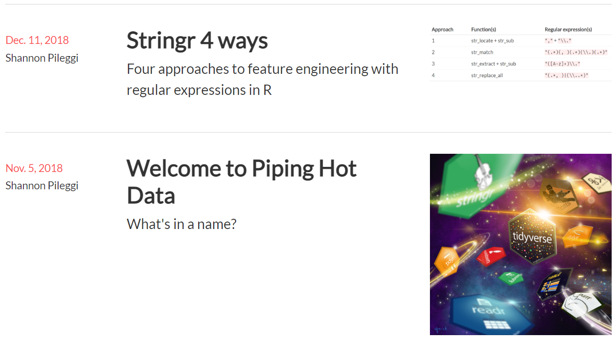

```{r setup, include=FALSE}
options(htmltools.dir.version = FALSE)
```

class: split-two white with-border

.column.bg-main1[.content.center[

<br/><br/>


<br/>
# R-Ladies Global  
<br/>
### [`r fontawesome::fa("twitter", fill = "#FFFFFF")` @RLadiesGlobal](https://twitter.com/rladiesglobal)<br/>

### [`r fontawesome::fa("paper-plane", fill = "#FFFFFF")` info@rladies.org](mailto:info@rladies.org)<br>

### [`r fontawesome::fa("link", fill = "#FFFFFF")` rladies.org](https://rladies.org)<br/>

### [`r fontawesome::fa("slack", fill = "#FFFFFF")` Join R-Ladies Slack](https://rladies-community-slack.herokuapp.com/)

]]

.column.bg-main2[.content.center[

<br/><br/>


<br/>
# R-Ladies Miami  
<br/>
### [`r fontawesome::fa("twitter", fill = "#FFFFFF")` @RLadiesMiami](https://twitter.com/RLadiesMiami)<br/>

### [`r fontawesome::fa("paper-plane", fill = "#FFFFFF")` miami@rladies.org](mailto:miami@rladies.org)<br>

]]

---

class: split-two white with-border

.column.bg-main2[.content.center[
<br/><br/>


# Dr. Shannon Pileggi <br/><br/>

### [`r anicon::faa("twitter", animate="float", color = "#FFFFFF")` @PipingHotData](https://twitter.com/PipingHotData)<br/>

### [`r fontawesome::fa("paper-plane", fill = "#FFFFFF")` shannon@pipinghotdata.com](mailto:shannon@pipinghotdata.com)<br>

### [`r fontawesome::fa("link", fill = "#FFFFFF")` pipinghotdata.com](https://www.pipinghotdata.com/)<br/>

### [`r fontawesome::fa("github", fill = "#FFFFFF")` github.com/shannonpileggi](https://github.com/shannonpileggi/)

### [`r fontawesome::fa("linkedin", fill = "#FFFFFF")` linkedin.com/in/shannon-m-pileggi/](https://www.linkedin.com/in/shannon-m-pileggi/)

]]

.column.bg-main1[.content.vmiddle.center[

### Presentation based on<br> the Aug 30, 2020 blog post:<br><br>

### [`r anicon::faa("link", animate="vertical", color = "#FFFFFF")` A job interview presentation<br> inspired by the R community: <br>How TidyTuesday and Twitter<br> helped me secure a job offer](https://www.pipinghotdata.com/posts/2020-08-30-a-job-interview-presentation-inspired-by-the-r-community/)<br/>

]]

---

layout: true
class: split-two with-thick-border border-white

.column[.content[
.split-two[
.row.bg-main5[.content.center.vmiddle[
# 1 <br><br> BACKGROUND
]]
.row.bg-main2[.content.center.vmiddle[
# 3 <br><br> CREATOR
]]
]
]]

.column[.content[
.split-two[
.row.bg-main3[.content.center.vmiddle[
# 2 <br><br> CONSUMER
]]
.row.bg-main1[.content.center.vmiddle[
# 4 <br><br> CONTRIBUTOR
]]
]
]]

??? INTRODUCE BACKGROUND

---

---
count: false
class: gray-row2-col1 gray-row1-col2 gray-row2-col2

---
layout: false
class: bg-main5 split-20 

.column.bg-main4[.content.vmiddle.center[

# Life changes <br><br>

.row[.content.nopadding[
.fig90[]
]] <br>

### Map adapted from <br><br> [`r anicon::faa("link", animate="vertical", color = "#FFFFFF")`](https://www.pipinghotdata.com/posts/2021-02-15-gganimating-a-geographic-introduction/) GGanimating <br> a geographic introduction

]]

.column.bg-main5[.content.center[

.row[.content.nopadding[
.img-fill[]
]]

]]

---
class: middle left bg-main1 
<br>

## Date: Oct 19, 2018

## To: Mine Çetinkaya-Rundel

## From: Shannon Pileggi

<br>

## _As far as the job search goes, I haven't found the right fit yet.  Now I am focusing more on fully remote companies.  In the meanwhile, I am starting to do some side projects to keep me active and build an online presence.  So hopefully my new blog will launch next week!  And I plan to get on twitter as well - I'm a bit scared of that!  I've been reading up on twitter etiquette so hopefully I don't do anything dumb._

??? keep this in?

---
layout: false
class: bg-main5 split-70 

.column.bg-main5[.content.vmiddle.center[

.row[.content.nopadding[
.fig90[]
]]

]]

.column.bg-main4[.content.vmiddle.center[

# Job interview<br>presentation instructions

<br><br>

### 20 minutes 

### focuses on market research

### innovative

### proud of

]]


---

layout: true
class: split-two with-thick-border border-white

.column[.content[
.split-two[
.row.bg-main5[.content.center.vmiddle[
# 1 <br><br> BACKGROUND
]]
.row.bg-main2[.content.center.vmiddle[
# 3 <br><br> CREATOR
]]
]
]]

.column[.content[
.split-two[
.row.bg-main3[.content.center.vmiddle[
# 2 <br><br> CONSUMER
]]
.row.bg-main1[.content.center.vmiddle[
# 4 <br><br> CONTRIBUTOR
]]
]
]]

??? INTRODUCE CONSUMER


---
count: true
class: gray-row1-col1 gray-row2-col1 gray-row2-col2


---
layout: true
class: split-three with-thick-border border-white

.column[.content[
.split-three[
.row.bg-main5[.content.center.vmiddle[
# What is the R community?
]]
.row.bg-main4[.content.center.vmiddle[
# Podcasts
]]
.row.bg-main2[.content.center.vmiddle[
# TidyTuesday
]]
]
]]

.column[.content[
.split-three[
.row.bg-main4[.content.center.vmiddle[
# YouTube
]]
.row.bg-main2[.content.center.vmiddle[
# Slack
]]
.row.bg-main1[.content.center.vmiddle[
# Meet-ups
]]
]
]]

.column[.content[
.split-three[
.row.bg-main2[.content.center.vmiddle[
# Twitter
]]
.row.bg-main1[.content.center.vmiddle[
# Conferences
]]
.row.bg-main4[.content.center.vmiddle[
# Blogs
]]
]
]]

??? what is R community

---
count: true
class: hide-row1-col2 hide-row1-col3 hide-row2-col1 hide-row2-col2 hide-row2-col3 hide-row3-col1 hide-row3-col2 hide-row3-col3

---
count: false


---
layout: false
class: bg-main5 split-70 

.column.bg-main5[.content.vmiddle.center[

.row[.content.nopadding[
.fig90[]
]]

]]

.column.bg-main4[.content.vmiddle.center[
<blockquote class="twitter-tweet"><p lang="en" dir="ltr">In this week&#39;s <a href="https://twitter.com/hashtag/tidytuesday?src=hash&amp;ref_src=twsrc%5Etfw">#tidytuesday</a> screencast, I use tidytext to analyze what titles get claps on Medium posts. Practical guides on tensorflow/keras are the hottest, words like &quot;marketing&quot;, &quot;trends&quot; and &quot;industry&quot; don&#39;t get you far <a href="https://t.co/oNhZm40mpW">https://t.co/oNhZm40mpW</a> <a href="https://twitter.com/hashtag/rstats?src=hash&amp;ref_src=twsrc%5Etfw">#rstats</a> <a href="https://t.co/cxYO2MIIqz">pic.twitter.com/cxYO2MIIqz</a></p>&mdash; David Robinson (@drob) <a href="https://twitter.com/drob/status/1069954125020958720?ref_src=twsrc%5Etfw">December 4, 2018</a></blockquote> <script async src="https://platform.twitter.com/widgets.js" charset="utf-8"></script>
]]

---

show tidytuesday content (but not compare to mine yet)

best way to build content structure?

[sheet](https://docs.google.com/spreadsheets/d/1IKF87Ab0GwLUhScodKLtg-qDuNGtZgoffXgZXXYey-U/edit?usp=sharing)

---
layout: false
class: bg-main5 split-70 

.column.bg-main5[.content.vmiddle.center[

.row[.content.nopadding[
.fig90[]
]]

]]

.column.bg-main4[.content.vmiddle.center[
<blockquote class="twitter-tweet"><p lang="en" dir="ltr">If you’re having trouble with xaringan, storyboards in flexdashboqrd can also make pretty nice presentations depending on the type of content / message you are trying to convey <a href="https://t.co/IC3moe01v0">https://t.co/IC3moe01v0</a></p>&mdash; Emily Riederer (@EmilyRiederer) <a href="https://twitter.com/EmilyRiederer/status/1073001289339027456?ref_src=twsrc%5Etfw">December 12, 2018</a></blockquote> <script async src="https://platform.twitter.com/widgets.js" charset="utf-8"></script>

]]


---
layout: false
class: bg-main5 split-70 

.column.bg-main5[.content.vmiddle.center[

.row[.content.nopadding[
.fig90[]
]]

]]

.column.bg-main4[.content.vmiddle.center[
<blockquote class="twitter-tweet"><p lang="en" dir="ltr">EMILY! this just blew my mind 🤯 thank you!</p>&mdash; Alison Presmanes Hill (@apreshill) <a href="https://twitter.com/apreshill/status/1073002204158603264?ref_src=twsrc%5Etfw">December 12, 2018</a></blockquote> <script async src="https://platform.twitter.com/widgets.js" charset="utf-8"></script>
]]


---

any other content here before move on to creator?


---
layout: true
class: split-two with-thick-border border-white

.column[.content[
.split-two[
.row.bg-main5[.content.center.vmiddle[
# 1 <br><br> BACKGROUND
]]
.row.bg-main2[.content.center.vmiddle[
# 3 <br><br> CREATOR
]]
]
]]

.column[.content[
.split-two[
.row.bg-main3[.content.center.vmiddle[
# 2 <br><br> CONSUMER
]]
.row.bg-main1[.content.center.vmiddle[
# 4 <br><br> CONTRIBUTOR
]]
]
]]

---
count: false
class: gray-row1-col1 gray-row1-col2 gray-row2-col2


---
layout: false

show tidytuesday analysis next to mine, highlight original content


---
layout: false
class: split-two 

.column[.content[
.split-two[
.row.bg-main2[.center.vmiddle[
### [`r fontawesome::fa("link")` Presentation](https://spileggi.shinyapps.io/Pileggi_presentation_shiny/)<br/>

]]
.row.bg-main2[.center.vmiddle[
### [`r fontawesome::fa("link")` Shiny 1](https://spileggi.shinyapps.io/tweet_lookup/)<br/>

]]
]
]]

.column[.content[
.split-two[
.row.bg-main2[.center.vmiddle[
### [`r fontawesome::fa("link")` Code](https://github.com/shannonpileggi/Adelphi-tweets)<br/>

]]
.row.bg-main2[.center.vmiddle[
### [`r fontawesome::fa("link")` Shiny 2](https://spileggi.shinyapps.io/tweet_network/)<br/>

]]
]
]]

---

class: center middle


---
layout: false
class: split-two white with-border

.column.bg-main2[.content.left.center[
<br><br>
# WHAT I DID WELL
<br><br>
## Mirrored TidyTuesday analysis
<br>
## Researched audience
<br>
## Hosted presentation online 
<br>
## Didn’t use powerpoint

]]

.column.bg-main1[.content.left.center[
<br><br>
# WHAT I WOULD HAVE DONE DIFFERENTLY
<br><br>
## Limited scope
<br>
## Change ggplot default colors

]]


---

layout: true
class: split-two with-thick-border border-white

.column[.content[
.split-two[
.row.bg-main5[.content.center.vmiddle[
# 1 <br><br> BACKGROUND
]]
.row.bg-main2[.content.center.vmiddle[
# 3 <br><br> CREATOR
]]
]
]]

.column[.content[
.split-two[
.row.bg-main3[.content.center.vmiddle[
# 2 <br><br> CONSUMER
]]
.row.bg-main1[.content.center.vmiddle[
# 4 <br><br> CONTRIBUTOR
]]
]
]]

---
count: false
class: gray-row1-col1 gray-row1-col2 gray-row2-col1

??? INTRODUCE contributor


---
layout: true
class: split-two with-thick-border border-black

.column[.content[
.split-two[
.row.bg-main5[.content.left.vmiddle[
# You might be thinking 
# something like...
### Mara Averick, rstudio::conf(2018)
### [Contributing to Tidyverse packages](https://www.rstudio.com/resources/rstudioconf-2018/contributing-to-tidyverse-packages/)
]]
.row[
.img-fill[]
]]
]]

.column[.content[
.split-two[
.row.bg-main5[.content.center.vmiddle[
.img-fill[]
]]
.row.bg-main3[.content.center.vmiddle[
# But contributing can be more than packages, pull requests, and issues!
]]
]
]]

---
count: true
class: hide-row2-col1 hide-row2-col2

---
count: false


---
layout: false
class: split-three with-thick-border border-white

.column[.content[
.split-three[
.row.bg-main5[.content.center.vmiddle[
# What is the R community?
]]
.row.bg-main4[.content.center.vmiddle[
# Podcasts
]]
.row.bg-main2[.content.center.vmiddle[
# TidyTuesday
]]
]
]]

.column[.content[
.split-three[
.row.bg-main4[.content.center.vmiddle[
# YouTube
]]
.row.bg-main2[.content.center.vmiddle[
# Slack
]]
.row.bg-main1[.content.center.vmiddle[
# Meet-ups
]]
]
]]

.column[.content[
.split-three[
.row.bg-main2[.content.center.vmiddle[
# Twitter
]]
.row.bg-main1[.content.center.vmiddle[
# Conferences
]]
.row.bg-main4[.content.center.vmiddle[
# Blogs
]]
]
]]

---
layout: true
class: split-two with-thick-border border-white

.row[.content[
.split-two[
.column.bg-main3[.content.center.vmiddle[
.img-fill[]
]]
.column.bg-main2[.content.center.vmiddle[
# calendar flip
]]
]
]]

.row[.content.nopadding[
# now
]]

---

---
layout: false

show 2 blog posts in 2018, then calendar flipping gif or something

jump to 2020

R-Ladies meet ups

Blog posts

WeAreRLadies rotating curator


---
layout: true
class: split-three with-thick-border border-white

.column[.content[
.split-three[
.row.bg-main5[.content.center.vmiddle[
# How do I contribute?
]]
.row.bg-main4[.content.center.vmiddle[
# Podcasts
]]
.row.bg-main2[.content.center.vmiddle[
# TidyTuesday
]]
]
]]

.column[.content[
.split-three[
.row.bg-main4[.content.center.vmiddle[
# YouTube
]]
.row.bg-main2[.content.center.vmiddle[
# Slack
]]
.row.bg-main1[.content.center.vmiddle[
# Meet-ups
]]
]
]]

.column[.content[
.split-three[
.row.bg-main2[.content.center.vmiddle[
# Twitter
]]
.row.bg-main1[.content.center.vmiddle[
# Conferences
]]
.row.bg-main4[.content.center.vmiddle[
# Blogs
]]
]
]]

??? how am i a contributor

---
count: true

---
count: false
class: gray-row1-col2 gray-row2-col1 gray-row2-col3 gray-row3-col1 


---
layout: false

summary??

---
layout: false
class: split-30 with-thick-border border-white

.row[.content[
.split-three[
.column.bg-main3[.content.center.vmiddle[
# consumer
]]
.column.bg-main2[.content.center.vmiddle[
# creator
]]
.column.bg-main1[.content.center.vmiddle[
# contributor
]]
]
]]

.row[.content.nopadding[
.img-fill[]
]]


---

layout: false
class: split-20 with-thick-border border-white

.row.bg-main1[.content.vmiddle[
# RESOURCES
]]

.row[.content[
.split-two[
.column.bg-main2[.content[
## Technical
<br/>
### [`r emo::ji("package")` Emi Tanaka {anicon}](https://github.com/emitanaka/anicon)<br/>

### [⚔   Emi Tanaka kunoichi {xaringan} theme](https://github.com/emitanaka/ninja-theme)<br/>

### [`r emo::ji("rocket")` Silvia Canelón deploying {xaringan}](https://silvia.rbind.io/2021-03-16-deploying-xaringan-slides/)<br/>

### [`r emo::ji("calendar")` Jay Jacobs `ggcal.R`](https://github.com/jayjacobs/ggcal/blob/master/R/ggcal.R)<br/>

]]
.column.bg-main3[.content[
## Content
<br/>

### [`r emo::ji("pen")` Emily Riederer talk preparation](https://emilyriederer.netlify.app/post/writing-a-tech-talk/)<br/>

### [`r emo::ji("purple heart")` R-Ladies Seattle Meet-up: How to give a good talk](https://www.meetup.com/rladies-seattle/events/276427163/)

### [`r emo::ji("podcast")` Build a Career in Data Science podcast Ep. 14: Joining the Community](https://open.spotify.com/episode/5f38UxOPD79hrwL9QwAPJ2?si=853e40d78db1453a)

### [`r fontawesome::fa("twitter", fill = "#1DA1F2")` Twitter crowdsourcing calendar style](https://twitter.com/PipingHotData/status/1381061594898128902)
]]
]
]]

---
class: middle center bg-main1 
<br><br>
# THANK YOU FOR JOINING ME TODAY
<br>
### [`r anicon::faa("twitter", animate="float", color = "#FFFFFF")` @PipingHotData](https://twitter.com/PipingHotData)<br/>

### [`r fontawesome::fa("paper-plane", fill = "#FFFFFF")` shannon@pipinghotdata.com](mailto:shannon@pipinghotdata.com)<br>

### [`r fontawesome::fa("link", fill = "#FFFFFF")` pipinghotdata.com](https://www.pipinghotdata.com/)<br/>

### [`r fontawesome::fa("github", fill = "#FFFFFF")` github.com/shannonpileggi](https://github.com/shannonpileggi/)

### [`r fontawesome::fa("linkedin", fill = "#FFFFFF")` linkedin.com/in/shannon-m-pileggi/](https://www.linkedin.com/in/shannon-m-pileggi/)


