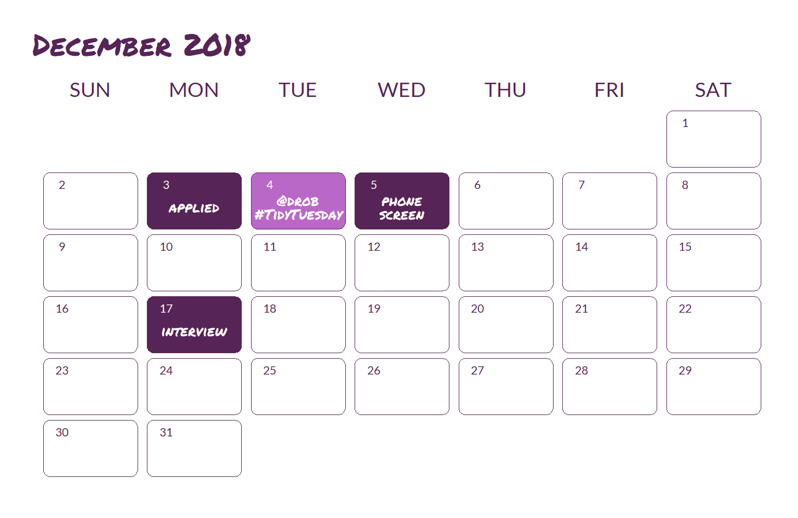
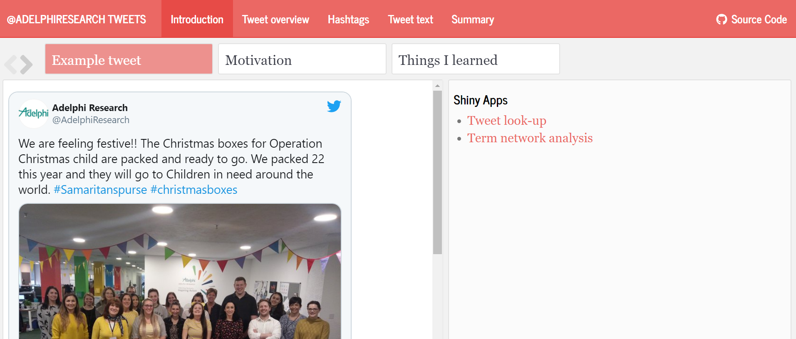

```{r setup, include=FALSE}
options(htmltools.dir.version = FALSE)
```

class: inverse 
count: false

background-image: url(img/vedrana-filipovic-wMQxgk2NhvI-unsplash.jpg)
background-size: cover
.title-slide-shannon[
# Leveraging the R community for a job interview
# R-Ladies Philly Lightning Talk
# Shannon Pileggi
# June 16, 2021
<br><br><br><br><br><br><br><br><br><br><br><br><br><br><br><br><br>
.right[
### Photo by [Vedrana Filipović](https://unsplash.com/photos/wMQxgk2NhvI)
]
]


---

class: split-two white with-border

.column.bg-main3[.content.center[
<br/><br/>


# Dr. Shannon Pileggi <br/><br/>

### [`r anicon::faa("twitter", animate="float", color = "#FFFFFF")` @PipingHotData](https://twitter.com/PipingHotData)<br/>

### [`r fontawesome::fa("paper-plane", fill = "#FFFFFF")` shannon@pipinghotdata.com](mailto:shannon@pipinghotdata.com)<br>

### [`r fontawesome::fa("link", fill = "#FFFFFF")` pipinghotdata.com](https://www.pipinghotdata.com/)<br/>

### [`r fontawesome::fa("github", fill = "#FFFFFF")` github.com/shannonpileggi](https://github.com/shannonpileggi/)

### [`r fontawesome::fa("linkedin", fill = "#FFFFFF")` linkedin.com/in/shannon-m-pileggi/](https://www.linkedin.com/in/shannon-m-pileggi/)

]]

.column.bg-main1[.content.vmiddle.center[

### [`r anicon::faa("bolt", animate="wrench", color = "#FFFFFF")` Lightning talk abbreviated from <br/>R-Ladies Miami April presentation<br/> "Growing into the R community"](https://github.com/shannonpileggi/growing-into-r)<br/><br/>

### Which was inspired by<br/>the Aug 30, 2020 blog post:<br><br>

### [`r anicon::faa("link", animate="vertical", color = "#FFFFFF")` A job interview presentation<br> inspired by the R community: <br>How TidyTuesday and Twitter<br> helped me secure a job offer](https://www.pipinghotdata.com/posts/2020-08-30-a-job-interview-presentation-inspired-by-the-r-community/)<br/>

]]


---
layout: false
class: bg-main3 split-70 

.column.bg-main3[.content.vmiddle.center[

.row[.content.nopadding[
.fig90[]
]]

]]

.column.bg-main3[.content.vmiddle.center[

# Job interview<br>presentation instructions

<br><br>

### 20 minutes 

### focuses on market research

### innovative

### proud of

]]


---
layout: false
class: bg-main3 split-70 

.column.bg-main3[.content.vmiddle.center[

.row[.content.nopadding[
.fig90[]
]]

]]

.column.bg-main3[.content.vmiddle.center[
<blockquote class="twitter-tweet"><p lang="en" dir="ltr">In this week&#39;s <a href="https://twitter.com/hashtag/tidytuesday?src=hash&amp;ref_src=twsrc%5Etfw">#tidytuesday</a> screencast, I use tidytext to analyze what titles get claps on Medium posts. Practical guides on tensorflow/keras are the hottest, words like &quot;marketing&quot;, &quot;trends&quot; and &quot;industry&quot; don&#39;t get you far <a href="https://t.co/oNhZm40mpW">https://t.co/oNhZm40mpW</a> <a href="https://twitter.com/hashtag/rstats?src=hash&amp;ref_src=twsrc%5Etfw">#rstats</a> <a href="https://t.co/cxYO2MIIqz">pic.twitter.com/cxYO2MIIqz</a></p>&mdash; David Robinson (@drob) <a href="https://twitter.com/drob/status/1069954125020958720?ref_src=twsrc%5Etfw">December 4, 2018</a></blockquote> <script async src="https://platform.twitter.com/widgets.js" charset="utf-8"></script>
]]


---
layout: false
class: bg-main3 split-70 

.column.bg-main3[.content.vmiddle.center[

.row[.content.nopadding[
.fig90[]
]]

]]

.column.bg-main3[.content.vmiddle.center[
<blockquote class="twitter-tweet"><p lang="en" dir="ltr">If you’re having trouble with xaringan, storyboards in flexdashboqrd can also make pretty nice presentations depending on the type of content / message you are trying to convey <a href="https://t.co/IC3moe01v0">https://t.co/IC3moe01v0</a></p>&mdash; Emily Riederer (@EmilyRiederer) <a href="https://twitter.com/EmilyRiederer/status/1073001289339027456?ref_src=twsrc%5Etfw">December 12, 2018</a></blockquote> <script async src="https://platform.twitter.com/widgets.js" charset="utf-8"></script>

]]


---
layout: false
background-image: url(img/compare-1.svg)
background-size: cover

---
layout: false
count: false
background-image: url(img/compare-2.svg)
background-size: cover

---
layout: false
count: false
background-image: url(img/compare-3.svg)
background-size: cover

---
layout: false
count: false
background-image: url(img/compare-4.svg)
background-size: cover

--
.title-slide-shannon[
<br><br><br><br>
.right[
### [technical details `r anicon::faa("link", animate="vertical", color = "#FFFFFF")`](https://www.pipinghotdata.com/posts/2020-08-30-a-job-interview-presentation-inspired-by-the-r-community/#what-i-did)

### [@drob code `r fontawesome::fa("github", fill = "#FFFFFF")`](https://github.com/dgrtwo/data-screencasts/blob/master/medium-datasci.Rmd)

### [@drob video `r fontawesome::fa("youtube", fill = "#FFFFFF")`](https://www.youtube.com/watch?v=C69QyycHsgE)

]]

---
layout: false
class: split-two bg-main2

.column[.content[
.split-two[
.row.bg-main2[.center.vmiddle[
### [`r fontawesome::fa("link")` Presentation](https://spileggi.shinyapps.io/Pileggi_presentation_shiny/)<br/>

]]
.row.bg-main2[.center[
### [`r fontawesome::fa("link")` Shiny 1](https://spileggi.shinyapps.io/tweet_lookup/)<br/>

]]
]
]]

.column[.content[
.split-two[
.row.bg-main2[.center.vmiddle[
### [`r fontawesome::fa("link")` Code](https://github.com/shannonpileggi/Adelphi-tweets)<br/>

]]
.row.bg-main2[.center[
### [`r fontawesome::fa("link")` Shiny 2](https://spileggi.shinyapps.io/tweet_network/)<br/>

]]
]
]]

---

class: center middle

```{r, echo=FALSE, out.width="70%"}
knitr::include_graphics("https://media.giphy.com/media/N1eKZPdggHGwM/giphy.gif")
```


---
layout: false
class: split-two white with-border

.column.bg-main2[.content.left.center[
<br><br>
# WHAT I DID WELL
<br><br>
## Mirrored TidyTuesday analysis
<br>
## Researched audience
<br>
## Hosted presentation online 
<br>
## Didn’t use powerpoint

]]

.column.bg-main1[.content.left.center[
<br><br>
# WHAT I WOULD HAVE DONE DIFFERENTLY
<br><br>
## Limited scope
<br>
## Change ggplot default colors

]]

---
background-image: url(img/austin-neill-ZahNAl_Ic3o-unsplash.jpg)
background-size: cover
.title-slide-shannon[
<br><br><br><br><br><br><br><br><br><br><br><br><br><br><br><br><br><br><br><br><br><br><br><br><br><br><br>
.right[
### Photo by [Austin Neil](https://unsplash.com/photos/ZahNAl_Ic3o)
]
]

???
re-using learnings in work & personal
scaffolding to more open-ended projects?


---
class: middle center bg-main1 
<br><br>
# THANK YOU FOR JOINING ME TODAY
<br>
### [`r anicon::faa("twitter", animate="float", color = "#FFFFFF")` @PipingHotData](https://twitter.com/PipingHotData)<br/>

### [`r fontawesome::fa("paper-plane", fill = "#FFFFFF")` shannon@pipinghotdata.com](mailto:shannon@pipinghotdata.com)<br>

### [`r fontawesome::fa("link", fill = "#FFFFFF")` pipinghotdata.com](https://www.pipinghotdata.com/)<br/>

### [`r fontawesome::fa("github", fill = "#FFFFFF")` github.com/shannonpileggi](https://github.com/shannonpileggi/)

### [`r fontawesome::fa("linkedin", fill = "#FFFFFF")` linkedin.com/in/shannon-m-pileggi/](https://www.linkedin.com/in/shannon-m-pileggi/)


```{r metathis, echo=FALSE}
library(metathis)
meta() %>%
  meta_name("github-repo" = "https://github.com/shannonpileggi/growing-into-r") %>% 
  meta_social(
    title = "Growing into the R community: Consumer, Creator, Contributor",
    description = paste(
      "An R-Ladies Miami meet-up talk: Starting something new in R can be daunting, but there are many community resources that can help! In this presentation, I’ll discuss how I crafted a job interview presentation by making modifications on publicly available TidyTuesday code. This built the technical and confidence-boosting scaffolding I needed for more open-ended projects. The success of this experience inspired me to transition from my role as a consumer and creator to contributor to give back to the R community, which has been incredibly fulfilling. Despite social distancing, I feel more connected to the R community than ever before!"
    ),
    url = "https://shannonpileggi.github.io/growing-into-r/#1",
    image = "https://github.com/shannonpileggi/growing-into-r/blob/main/img/cover.PNG?raw=true",
    image_alt = paste(
      "Title slide of Growing into the R Community (image of purple crocus)"
    ),
    og_type = "website",
    og_author = "Shannon Pileggi",
    twitter_card_type = "summary_large_image",
    twitter_creator = "@PipingHotdata",
    twitter_site = "@PipingHotdata"
  )
```
